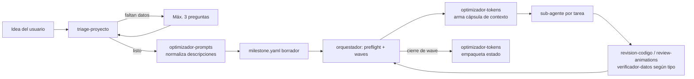

# PLAN-MEJORA-SKILLS.md — Ampliación del harness con 6 nuevas capacidades

> Documento de trabajo para Claude Code. Describe **qué** construir, **dónde**,
> **cómo se integra con el orquestador** y **cómo se valida**. Está pensado para
> ejecutarse como un milestone más del propio harness (ver Anexo A).

---

## 0. Cómo usar este plan

1. Este archivo y la carpeta `insumos-plan-mejora/` viven en la raíz del repo.
2. Abrir Claude Code en `C:\Users\juand\Electiva\Harness` y pegar el prompt del
   **Anexo B**.
3. Claude Code crea `milestones/mejora-skills/milestone.yaml` a partir del
   **Anexo A** y lo corre con `/orquestador` (waves, gate por wave, etc.).

Insumos (contenido fuente, no se reescribe desde cero):

| Archivo en `insumos-plan-mejora/` | Qué es |
|---|---|
| `presentaciones-visuales.SKILL.md` | Skill ya escrita por Diego (extraída del `.skill`) |
| `optimizador-prompts.SKILL.md` | Skill ya escrita por Diego |
| `verificador-datos.SKILL.md` | Skill ya escrita por Diego |
| `plan-skill-filtro.md` | Plan de la skill "Project Triage & Scoping Router" |
| `plan-token-optimizer.md` | Plan de la skill de optimización/compresión de tokens |
| *(externo)* `github.com/emilkowalski/skills` | Suite de skills de diseño/animación de Emil Kowalski (MIT) |

---

## 1. Punto de partida (estado actual del harness)

- 6 skills en `.claude/skills/`: `orquestador`, `especificacion`,
  `frontend-design` (copia literal de Anthropic), `revision-codigo`,
  `documentacion`, `testing`.
- Modelo **milestone → waves** con `milestone.yaml`, `estado.yaml`,
  `decisiones.md`, `bloqueos-externos.md` por milestone.
- `tipo` de tarea actual: `backend | frontend | data | cli | mobile | docs | testing | otro`.
- Regla clave: **un sub-agente nunca pregunta al usuario**; devuelve
  `DECISION_NEEDED` y el orquestador lo agrupa en el batched gate.
- Milestones existentes: `panel-tareas-demo` (cerrado) y `enigma-go`
  (app Expo / React Native, en curso).
- Hay un worktree viejo en `.claude/worktrees/agent-a21d2a89aa8d83f44/` con
  copias de las skills. **No editar nada ahí.**

---

## 2. Resumen de mejoras

| # | Skill nueva (carpeta) | Origen | Rol en el harness |
|---|---|---|---|
| M1 | `presentaciones-visuales` | Insumo de Diego, adaptado | Genera decks HTML; nuevo `tipo: presentacion` |
| M2 | `optimizador-prompts` | Insumo de Diego, adaptado | Normaliza ideas → prompts; plantilla de prompt de sub-agente |
| M3 | `verificador-datos` | Insumo de Diego, adaptado | Fact-check de docs, README y slides antes de cerrar |
| M4 | Suite Emil Kowalski (12 carpetas) | Vendorizada de `emilkowalski/skills` | Pulido de UI, animación web y Expo, revisión de motion |
| M5 | `triage-proyecto` | Plan "skill filtro", rediseñado | **Puerta de entrada**: idea ambigua → clasificación + `milestone.yaml` borrador |
| M6 | `optimizador-tokens` | Plan "token optimizer", rediseñado | Compacta contexto hacia sub-agentes y empaqueta estado al cerrar waves |
| M7 | *(cambios en `orquestador`)* | — | Nuevos tipos, nuevas filas en §8, enganche de M5 y M6 |
| M8 | *(docs)* | — | `CLAUDE.md`, `RESUMEN-HARNESS.md`, `PROCESO.md`, `README.md` |
| M9 | *(validación E2E)* | — | Corrida de punta a punta con las skills nuevas |

Flujo objetivo:



---

## 3. Reglas transversales (aplican a todas las tareas)

1. **Ubicación**: cada skill en `.claude/skills/<nombre>/SKILL.md`, estructura
   plana (Claude Code descubre skills por carpeta de primer nivel). Material
   auxiliar en la misma carpeta (`PLANTILLA.md`, `scripts/`, etc.).
2. **Frontmatter**: `name` igual al nombre de la carpeta; `description` en
   una o dos frases que digan *qué hace* y *cuándo se dispara*. Las
   descripciones se cargan en el contexto siempre, así que nada de listas
   largas de frases gatillo (ver M6, sección "palancas nativas").
3. **Idioma**: documentación y skills propias en español. Unificar el
   registro de las skills de Diego (hoy en español de España: "vídeo",
   "úsala") con el resto del harness. Las skills vendorizadas de Emil se
   quedan en inglés, sin tocar.
4. **Compatibilidad con el gate**: toda skill propia que hoy dice "pregunta
   al usuario" debe tener una variante explícita: *si corre dentro de un
   sub-agente del orquestador, no preguntes: asume lo razonable, lista los
   supuestos, y si el supuesto es de alto impacto devuelve `DECISION_NEEDED`*.
5. **Salidas a archivo, no al chat**: cuando la skill genera un artefacto
   grande (HTML, informe), lo escribe a disco y en el chat muestra solo un
   resumen y la ruta. Ahorra tokens y deja trazabilidad.
6. **Archivos que toca cada tarea**: en las waves 1 y 2 cada tarea toca
   **solo su propia carpeta** de skill. `orquestador/SKILL.md` y los docs
   raíz se tocan solo en waves posteriores. Así no hay conflictos de merge
   entre tareas paralelas.
7. **Un commit por tarea**, mensaje en español, trazable al id (`M1: ...`).
8. **Todo cambio de diseño no trivial** queda en `PROCESO.md` con el porqué
   (misma convención que las secciones 1–13 existentes).

---

## 4. Especificación por mejora

### M1 — `presentaciones-visuales`

**Base**: `insumos-plan-mejora/presentaciones-visuales.SKILL.md` (se conserva
el proceso de 7 pasos, la tabla de estilos y las reglas de layout).

**Cambios a aplicar**:

1. **Salida a archivo**: escribir `presentaciones/<slug>.html` (un único HTML
   autocontenido). En el chat, solo "Resumen de enfoque" + "Estructura de
   slides" + ruta. Quitar "pegar el HTML completo en la respuesta".
2. **Precedencia con `frontend-design`**: la dirección estética (paleta,
   tipografía, evitar plantillas genéricas) la decide `frontend-design`; esta
   skill aporta la narrativa, la estructura de slides y las reglas de
   legibilidad. Resolver contradicciones actuales: el insumo sugiere "emojis
   minimalistas" y "números grandes para estadísticas", que `frontend-design`
   marca como patrones genéricos si no responden al contenido. Regla final:
   se permiten solo si el contenido lo justifica (un número grande solo si el
   dato *es* el mensaje).
3. **Lecciones de `PROCESO.md` §11** convertidas en checklist obligatorio
   antes de entregar:
   - Contraste ≥ 4.5:1 para texto normal en **cada** fondo usado (si un
     color de acento se usa sobre fondo claro y oscuro, definir dos
     variantes).
   - Buscar y eliminar los patrones cliché listados en `frontend-design`
     (etiquetas "PALABRA — fragmento", metadatos con punto medio "A · B · C",
     eyebrows en mayúsculas sobre cada título).
   - Pasada de **lenguaje llano**: "¿lo entiende alguien que no escribió el
     sistema?". Reemplazar jerga por la metáfora del tema.
4. **Fuentes**: por defecto stack del sistema; Google Fonts permitido con
   fallback declarado (quitar el ambiguo "solo si es seguro").
5. **Extras técnicos**: navegación ← → y botones, numeración visible,
   `@media print` con una slide por página (para exportar a PDF desde el
   navegador), `prefers-reduced-motion` respetado, notas del presentador
   opcionales en `<aside class="notas">` ocultas por defecto (tecla `N`).
6. **Integración con el guion**: si existe un guion (ej.
   `GUION-PRESENTACION.md`), las notas del presentador salen de ahí.
7. **Datos**: si el deck cita cifras o afirmaciones verificables, invocar
   `verificador-datos` antes de entregar (ver M3).

**Criterios de aceptación**:
- [ ] `.claude/skills/presentaciones-visuales/SKILL.md` existe, con frontmatter válido.
- [ ] El checklist de contraste / clichés / lenguaje llano está en la skill como paso obligatorio.
- [ ] La precedencia con `frontend-design` está escrita explícitamente.
- [ ] Prueba: generar `presentaciones/harness-clase.html` a partir de `RESUMEN-HARNESS.md`; abre en navegador, navega con teclado, imprime una slide por página, no tiene texto desbordado a 1280×720.

---

### M2 — `optimizador-prompts`

**Base**: `insumos-plan-mejora/optimizador-prompts.SKILL.md` (se conserva la
detección de herramienta objetivo, la extracción de 8 componentes y el
formato de respuesta).

**Cambios a aplicar**:

1. **Nuevo destino: "sub-agente del harness"**. Añadir una sección de
   adaptación con la plantilla de prompt autocontenido que hoy describe
   `orquestador` §5, para que el orquestador la reutilice:
   ```
   [TAREA] id, título, tipo
   [OBJETIVO] descripción
   [CRITERIOS DE ACEPTACIÓN] lista literal del manifest (nunca parafrasear)
   [CONTEXTO] cápsula de optimizador-tokens + rutas relevantes
   [SKILLS A APLICAR] según orquestador §8
   [RESTRICCIONES] worktree propio, puerto libre si levanta servidor, no tocar otras carpetas
   [PROTOCOLO DE DECISIÓN] bloque DECISION_NEEDED si hay ambigüedad real
   [ENTREGA] qué archivos, qué commit, autorrevisión antes de reportar
   ```
2. **Modo no interactivo**: si corre dentro de un sub-agente o del
   orquestador, no hace preguntas; lista supuestos.
3. **Frontera con `optimizador-tokens`**: este optimiza **claridad**
   (humano → IA); `optimizador-tokens` optimiza **densidad** (IA → IA).
   Escribirlo en ambas skills para que no se pisen.
4. **Recortar la `description`** a lo esencial (hoy enumera muchas
   herramientas y frases gatillo; eso se paga en cada sesión).

**Criterios de aceptación**:
- [ ] Skill en `.claude/skills/optimizador-prompts/` con la sección "Sub-agente del harness".
- [ ] La plantilla queda también como `PLANTILLA-SUBAGENTE.md` en la misma carpeta (la referencia M7).
- [ ] Prueba: tomar la descripción de una tarea de `milestones/enigma-go/milestone.yaml` y producir el prompt de sub-agente; los criterios de aceptación aparecen literales.

---

### M3 — `verificador-datos`

**Base**: `insumos-plan-mejora/verificador-datos.SKILL.md` (se conserva el
proceso de 8 pasos, las 6 categorías y el formato de informe).

**Cambios a aplicar**:

1. **Salida a archivo**: `milestones/<slug>/verificaciones/<id-tarea>.md`
   cuando corre dentro de un milestone; en el chat solo la recomendación
   final y el conteo por categoría.
2. **Enganche con el gate**: una afirmación ❌ *Incorrecta* que el sub-agente
   no puede corregir con una fuente clara → `DECISION_NEEDED`. Las ⚠️ y 🔶 se
   corrigen o matizan solas y quedan en el informe.
3. **Fuente primaria primero**: para afirmaciones sobre el propio repo
   (rutas, conteos de skills, "copiada sin modificar de X"), verificar contra
   el repo (`diff`, `git log`, `ls`) antes que contra la web.
4. **Web**: usar WebSearch/WebFetch para datos cambiantes (precios,
   versiones, disponibilidad). Si no hay web, poner la advertencia que ya
   trae el insumo.
5. **Cuándo se dispara en el harness** (va en M7): al cerrar tareas
   `tipo: docs` y `tipo: presentacion`, y sobre `README.md` /
   `RESUMEN-HARNESS.md` al cerrar el milestone.

**Criterios de aceptación**:
- [ ] Skill en `.claude/skills/verificador-datos/` con las reglas de gate y fuente primaria.
- [ ] Prueba: correrla sobre `RESUMEN-HARNESS.md`; debe comprobar contra el repo al menos (a) el número de skills declarado y (b) que `frontend-design` sigue idéntica a la upstream. Tras M8 el número de skills cambia: debe detectar si el doc quedó desactualizado.

---

### M4 — Suite de Emil Kowalski (vendorizada)

**Fuente**: `https://github.com/emilkowalski/skills`, licencia MIT, commit de
referencia `d16ebe6` (2026-09-24). Al momento de ejecutar, usar ese commit
o el último y **registrar el hash real usado**.

**Skills a incorporar** (nombres originales, sin renombrar, porque varias se
referencian entre sí por nombre):

| Skill | Para qué en este harness | Auto-invocable |
|---|---|---|
| `emil-design-eng` | Skill principal: pulido de UI, decisiones de animación, detalles de componentes | Sí |
| `animate` | Construir una animación web desde cero (curva, duración, propiedades) | Sí |
| `animate-expo` | Lo mismo para React Native / Expo (**relevante para `enigma-go`**) | Sí |
| `review-animations` | Revisión estricta de motion | No (`disable-model-invocation`) |
| `improve-animations` | Auditoría del código de animación + planes ejecutables | Sí |
| `find-animation-opportunities` | Dónde sí / dónde no animar (solo lectura) | Sí |
| `animation-vocabulary` | Glosario para pedir animaciones con el término exacto | Sí |
| `apple-design` | Principios de Apple (gestos, springs, materiales) para web | Sí |
| `mobile-native` | Que una web se sienta nativa en el móvil | Sí |
| `pick-ui-library` | Elegir librería en vez de reinventar componentes | No |
| `prototype` | Varias versiones de un componente con selector | No |
| `ask-sonner` | Guía de la librería de toasts Sonner | Sí |
| ~~`write-swift`~~ | **Excluida por defecto**: no hay proyectos Swift (decisión abierta, §7) | — |

**Procedimiento** (mismo estándar que se usó con `frontend-design`, ver `PROCESO.md` §5):

```bash
git clone https://github.com/emilkowalski/skills /tmp/emil-skills
cd /tmp/emil-skills && git rev-parse HEAD   # anotar el hash
for s in emil-design-eng animate animate-expo review-animations improve-animations \
         find-animation-opportunities animation-vocabulary apple-design mobile-native \
         pick-ui-library prototype ask-sonner; do
  cp -r "skills/$s" "<repo>/.claude/skills/$s"
  cp LICENSE "<repo>/.claude/skills/$s/LICENSE.txt"
done
diff -r /tmp/emil-skills/skills/<s> <repo>/.claude/skills/<s>   # debe salir vacío salvo LICENSE.txt
```

- Copia **byte a byte** (no reescribir ni "resumir" con una herramienta de fetch).
- Crear `docs/vendor/emilkowalski-skills.md` con: URL, hash, fecha, lista de
  skills copiadas, licencia, y cómo actualizar (repetir el procedimiento y
  hacer `diff`).
- Alternativa descartada: `npx skills@latest add emilkowalski/skills`. Es
  más rápida pero no deja claro qué versión quedó ni dónde la instala;
  la copia manual con hash fijo es reproducible.

**Reglas de convivencia** (se escriben en M7 y en `docs/vendor/...`):
- `frontend-design` decide la **identidad visual** (paleta, tipografía, layout).
- `emil-design-eng` / `animate` / `animate-expo` deciden **movimiento,
  micro-interacciones y detalles de componentes**.
- Si chocan en algo concreto: gana el brief del usuario; después
  `frontend-design` en lo estético y Emil en los valores de animación. La
  tarea debe hacer una lectura cruzada de ambas skills y anotar en
  `PROCESO.md` cualquier contradicción real encontrada.
- Las skills con `disable-model-invocation: true` no se disparan solas. Para
  que un sub-agente las use, el orquestador le indica en el prompt *"lee y
  aplica `.claude/skills/review-animations/SKILL.md`"* (lectura directa del
  archivo, no invocación).

**Criterios de aceptación**:
- [ ] 12 carpetas copiadas, `diff -r` limpio contra upstream (salvo `LICENSE.txt`).
- [ ] `docs/vendor/emilkowalski-skills.md` con hash real.
- [ ] Las referencias cruzadas entre skills de Emil resuelven (grep de nombres → carpetas existentes).

---

### M5 — `triage-proyecto` (filtro y clasificación)

**Base**: `insumos-plan-mejora/plan-skill-filtro.md`. Se conserva la idea
(front-door que convierte una idea ambigua en un manifiesto estructurado,
prohibido escribir código, máx. 3 preguntas) pero se **adapta al harness**:
lo que el plan original llama "orquestador que levanta agentes" ya existe y
consume `milestone.yaml`, así que la salida final de esta skill es ese
manifest.

**Mapeo del plan original al harness**:

| Plan original | En este harness |
|---|---|
| Catálogo de agentes (`Frontend_Agent`, `DBA_Agent`…) | Valores de `tipo` + lista de skills existentes en `.claude/skills/` (la skill lee la carpeta, no una lista fija) |
| `required_agents` | `tipos_requeridos` + `skills_requeridas` |
| `orchestration_plan` (array de strings) | `tareas` del `milestone.yaml` con `depende_de` y `criterios_aceptacion` |
| "El orquestador parsea y levanta instancias" | `/orquestador` corre preflight sobre el borrador |
| Salida "solo JSON" | JSON a archivo; en el chat, resumen corto |

**Proceso de la skill**:

1. Leer la idea. Detectar dominio, plataforma, stack, escala, restricciones.
2. **Clarificación**: si faltan plataforma, objetivo o alcance (la regla de
   "< 30 palabras" del plan queda como heurística, no como regla dura),
   hacer **máximo 3 preguntas de opción múltiple** con `AskUserQuestion`.
   Esta skill **sí** puede preguntar: corre en la puerta de entrada, antes
   de cualquier sub-agente.
3. Inferir requisitos no funcionales (seguridad, rendimiento, accesibilidad,
   offline) a partir del caso de uso, marcados como `inferido: true`.
4. Clasificar:
   - `dominio`: web | backend | mobile | data | cli | devops | contenido | mixto
   - `complejidad`: `baja` (1–3 tareas, 1–2 waves) | `media` (4–10 tareas) |
     `alta` (> 10 tareas o varias capas → **proponer partir en varios milestones**)
5. Descomponer en tareas con `id`, `titulo`, `tipo`, `depende_de`,
   `descripcion`, `criterios_aceptacion` verificables. Si una tarea no tiene
   criterios claros, dejar la lista vacía a propósito: el orquestador
   disparará `especificacion` (comportamiento ya existente).
6. Pasar las descripciones por `optimizador-prompts` (modo no interactivo).
7. Escribir:
   - `milestones/<slug>/triage.json` (clasificación, ver esquema abajo)
   - `milestones/<slug>/milestone.yaml` (borrador compatible con `orquestador` §1)
8. **Validar** el borrador con las mismas reglas del preflight (ids únicos,
   sin ciclos, dependencias resueltas). Si falla, corregir antes de entregar.
9. Proyectos imposibles o irreales: decirlo claro, proponer el alcance
   realista más cercano y clasificarlo con ese alcance.

**Esquema de `triage.json`** (guardar como `schema/triage.schema.json`):

```json
{
  "proyecto": "string",
  "slug": "kebab-case",
  "estado": "requiere_aclaracion | listo_para_orquestar",
  "preguntas_pendientes": ["máx. 3, solo si estado = requiere_aclaracion"],
  "clasificacion": {
    "dominio": "web|backend|mobile|data|cli|devops|contenido|mixto",
    "complejidad": "baja|media|alta",
    "alcance": "una frase"
  },
  "requisitos_tecnicos": { "frontend": "", "backend": "", "datos": "", "otros": "" },
  "requisitos_no_funcionales": [{ "requisito": "", "inferido": true }],
  "tipos_requeridos": ["backend", "frontend"],
  "skills_requeridas": ["especificacion", "frontend-design", "testing"],
  "fuera_de_alcance": ["..."],
  "riesgos": ["..."],
  "manifest": "milestones/<slug>/milestone.yaml"
}
```

Validación del JSON: `python -m jsonschema` (gratis, `pip install jsonschema`)
o un script mínimo en `scripts/validar_triage.py`.

**Pruebas de estrés** (del plan original, aterrizadas):

| Prueba | Input | Resultado esperado |
|---|---|---|
| Usuario vago | "Quiero un clon de Twitter" | `requiere_aclaracion`, ≤ 3 preguntas (escala, plataforma, stack) |
| Usuario sobre-detallado | El contenido de `milestones/enigma-go/plan.md` | Manifest que pasa preflight, sin perder tareas ni criterios del plan |
| Proyecto imposible | "Quiero una IA consciente de sí misma en HTML" | Expectativas ajustadas + plan web realista (ej. chatbot con API) |
| Regresión | Descripción en prosa del panel de tareas | Manifest equivalente a `milestones/panel-tareas-demo/milestone.yaml` (mismas dependencias T1→T2→T3/T4/T5) |

**Criterios de aceptación**:
- [ ] Skill en `.claude/skills/triage-proyecto/` + `schema/triage.schema.json`.
- [ ] Las 4 pruebas documentadas en `milestones/mejora-skills/pruebas/triage.md` con input, output y veredicto.
- [ ] Ningún manifest generado falla el preflight del orquestador.
- [ ] La skill no escribe código de producto en ningún caso.

---

### M6 — `optimizador-tokens`

**Base**: `insumos-plan-mejora/plan-token-optimizer.md`. Se conservan las
reglas de poda (minificar estructura, prosa → clave-valor, podar saludos y
confirmaciones), la protección de entidades críticas y la prueba de
retención. Se **adapta** en tres puntos clave:

**1. Dónde corre (dos modos)**

| Modo | Cuándo | Entrada | Salida |
|---|---|---|---|
| `capsula` | El orquestador va a lanzar un sub-agente y el contexto de referencia (resultados de waves previas, decisiones, docs relacionados) supera un umbral (~2.000 tokens estimados) | Contexto crudo | Bloque `[CONTEXTO]` compacto para el prompt del sub-agente |
| `empaquetar` | Cierre de cada wave y del milestone | `estado.yaml`, `decisiones.md`, resúmenes de tareas | `milestones/<slug>/contexto-compacto.md`, que una sesión reanudada lee **primero** |

Por debajo del umbral **no** se comprime: comprimir también gasta tokens.

**2. Qué nunca se toca** (lista dura, más estricta que el plan original):
- Código que el sub-agente va a editar (no se minifica: se le pasa la ruta).
- `criterios_aceptacion` y respuestas del batched gate: siempre literales.
- IDs de tarea, rutas, URLs, versiones, puertos, hashes, nombres de ramas.
- Credenciales: ni se comprimen ni se copian; si aparecen en el contexto, se omiten y se avisa.

**3. Métricas medidas por script, no "estimadas" por el modelo**

El modelo no sabe contar sus propios tokens con exactitud. Las métricas del
JSON de salida las calcula un script:

- `scripts/medir_tokens.py`: cuenta caracteres y estima tokens (≈ caracteres/4,
  marcado como `"metodo": "estimado"`). Opcional: si existe
  `ANTHROPIC_API_KEY`, usar el endpoint oficial de conteo de tokens y marcar
  `"metodo": "api"` (revisar en la documentación vigente si tiene costo o
  límites antes de activarlo).
- `scripts/verificar_entidades.py`: extrae con regex del texto original las
  entidades protegidas (rutas, `T\d+`, versiones `\d+\.\d+`, URLs, puertos,
  hashes) y **falla** si alguna no aparece en la cápsula. Esto convierte
  "lossless" en un criterio verificable.

Formato de salida (adaptado del plan original):

```json
{
  "modo": "capsula",
  "nivel": "suave | medio | agresivo",
  "payload": "UI:[modo_oscuro,carga_rapida]|Stack:React,Node|Tarea:T4_login|Rutas:ui/nueva-tarea.html",
  "metricas": { "tokens_original": 1450, "tokens_final": 120, "ahorro": "92%", "metodo": "estimado" },
  "entidades_preservadas": true
}
```

Nivel por defecto: `suave` para prompts de sub-agentes; `medio` para
empaquetado de sesión. `agresivo` solo con prueba de retención aprobada.

**4. Palancas nativas de Claude Code** (sección propia dentro de la skill,
porque ahorran más que comprimir texto). Verificar cada una contra la
documentación vigente de Claude Code antes de escribirla como regla:
- `CLAUDE.md` corto; el detalle vive en las skills (que se cargan bajo demanda).
- `description` de cada skill corta: es lo único que siempre está en contexto.
- Skills de uso raro con `disable-model-invocation: true` (no ocupan lugar
  en la lista que ve el modelo). Aplica a skills propias; las de Emil no se
  editan (ver decisión abierta en §7).
- Elegir modelo por sub-agente (parámetro `model` del tool `Agent`): un
  modelo más liviano para tareas `docs` simples o de solo lectura; el
  principal para lógica compleja. Propuesta de campo opcional `modelo:` en
  el manifest.
- Exploración amplia del repo con sub-agentes de búsqueda, para que el
  volcado de archivos no llene el contexto del orquestador.

**Prueba de retención (lossless)**: tomar la tarea T2 de
`panel-tareas-demo`; correr un sub-agente con el contexto completo y otro
con la cápsula `suave`. Ambos resultados deben cumplir los mismos
criterios de aceptación. Documentar ahorro y resultado en
`milestones/mejora-skills/pruebas/tokens.md`. Hacerlo **una vez** (la prueba
en sí gasta tokens).

**Criterios de aceptación**:
- [ ] Skill en `.claude/skills/optimizador-tokens/` con los dos modos, la lista "nunca se toca" y la sección de palancas nativas.
- [ ] `scripts/medir_tokens.py` y `scripts/verificar_entidades.py` funcionan con Python estándar (sin dependencias de pago).
- [ ] Prueba de retención documentada con veredicto.
- [ ] Frontera con `optimizador-prompts` escrita en ambas skills.

---

### M7 — Integración en `orquestador/SKILL.md`

Depende de M1–M6. Cambios concretos:

1. **§1 manifest**: añadir tipos `presentacion` y `contenido` a la lista de
   `tipo`. Añadir campo opcional `modelo:` por tarea (ver M6).
2. **Nueva sección "Entrada desde una idea"**: si el usuario trae una idea en
   vez de un manifest, invocar primero `triage-proyecto`; el manifest
   resultante entra al preflight normal. El plan de waves se sigue mostrando
   como hoy (informativo, no gate).
3. **§5 prompt del sub-agente**: construirlo con
   `optimizador-prompts/PLANTILLA-SUBAGENTE.md`; si el contexto supera el
   umbral, pasar antes por `optimizador-tokens` modo `capsula`.
4. **§8 tabla de activación**, filas nuevas:

| Momento | Condición | Skill |
|---|---|---|
| Antes de todo | El usuario trae una idea, no un manifest | `triage-proyecto` |
| Al armar el prompt del sub-agente | Siempre | `optimizador-prompts` (plantilla) |
| Al armar el prompt del sub-agente | Contexto de referencia > umbral | `optimizador-tokens` (`capsula`) |
| Durante la implementación | `tipo: frontend` | `frontend-design` + `emil-design-eng` |
| Durante la implementación | La tarea crea o cambia animaciones (web) | `animate` |
| Durante la implementación | `tipo: mobile` con React Native / Expo y motion | `animate-expo` |
| Durante la implementación | Web pensada para uso en móvil | `mobile-native` |
| Durante la implementación | `tipo: presentacion` | `presentaciones-visuales` (+ `frontend-design`) |
| Antes de reportarse COMPLETADA | El diff toca transiciones / animaciones | `review-animations` (lectura directa del archivo), dentro de la autorrevisión |
| Antes de reportarse COMPLETADA | `tipo: docs`, `presentacion` o `contenido` con afirmaciones verificables | `verificador-datos` |
| Al cerrar cada wave | Siempre | `optimizador-tokens` (`empaquetar`) |
| Al cerrar el milestone | Siempre | `verificador-datos` sobre README / docs tocados |

5. **§9 reanudación**: una sesión que reanuda lee `contexto-compacto.md`
   antes que `estado.yaml` + `decisiones.md` completos.

**Criterios de aceptación**:
- [ ] Preflight sigue aceptando los manifests existentes (`panel-tareas-demo`, `enigma-go`) sin cambios: los campos nuevos son opcionales.
- [ ] La tabla §8 nombra solo skills que existen en `.claude/skills/`.

---

### M8 — Documentación

- `CLAUDE.md`: tabla de skills actualizada (propias + vendorizadas agrupadas
  en una fila "Suite Emil Kowalski", con enlace a `docs/vendor/...`).
- `RESUMEN-HARNESS.md`: §1 con el nuevo conteo y tabla; diagrama de flujo
  con `triage-proyecto` en la entrada y `optimizador-tokens` en el armado de
  prompts y el cierre de wave.
- `README.md`: "las 6 skills" → número real; mencionar la puerta de entrada.
- `PROCESO.md`: nueva sección **§14 Ampliación de skills** con las
  decisiones de diseño de este plan (por qué triage escribe `milestone.yaml`
  y no JSON libre, por qué las métricas las mide un script, por qué Emil se
  vendoriza con hash fijo, contradicciones encontradas entre
  `frontend-design` y Emil, resultado de las pruebas).
- Al final, correr `verificador-datos` sobre estos cuatro archivos.

---

### M9 — Validación de punta a punta

Corrida real (no simulada), igual que se hizo con `panel-tareas-demo`:

1. Idea de entrada: *"Una landing page para presentar Enigma Go en clase, con
   una animación de entrada y un deck de 5 slides que explique el juego."*
2. Esperado:
   - `triage-proyecto` clasifica (`mixto`, complejidad baja/media) y genera
     manifest con al menos una tarea `frontend` y una `presentacion`.
   - El orquestador corre las waves; los prompts de sub-agentes usan la
     plantilla.
   - La tarea frontend aplica `frontend-design` + `emil-design-eng` + `animate`
     y pasa `review-animations` en la autorrevisión.
   - La tarea de presentación pasa `verificador-datos`.
   - Al cerrar cada wave existe `contexto-compacto.md` y
     `verificar_entidades.py` sale en verde.
3. Resultado documentado en `milestones/e2e-skills/` y resumido en `PROCESO.md` §14.

---

## 5. Orden de ejecución (waves)

| Wave | Tareas | Por qué así |
|---|---|---|
| 1 | M1, M2, M3, M4 | Independientes; cada una toca solo su carpeta. Cap 3 → 2 lotes |
| 2 | M5, M6 | M5 usa `optimizador-prompts` (M2); M6 define la frontera con M2 |
| 3 | M7 | Necesita que existan todas las skills que va a referenciar |
| 4 | M8 | Documenta lo ya integrado |
| 5 | M9 | Valida el sistema completo |

---

## 6. Riesgos y cómo se mitigan

| Riesgo | Mitigación |
|---|---|
| 12 skills de Emil suman descripciones al contexto de cada sesión | Medir con `medir_tokens.py` antes/después; decisión abierta sobre excluir o desactivar algunas |
| Reglas contradictorias entre `frontend-design`, `presentaciones-visuales` y Emil | Precedencia escrita (M1, M4) + lectura cruzada registrada en `PROCESO.md` |
| La compresión hace que un sub-agente "alucine" detalles | Nivel `suave` por defecto, entidades protegidas con script, prueba de retención |
| Triage genera manifests que no pasan preflight | Paso 8 de M5: validación previa obligatoria |
| Editar por error las copias en `.claude/worktrees/` | Regla transversal; revisar `git status` antes de cada commit |
| Upstream de Emil cambia | Hash fijo + procedimiento de actualización con `diff` en `docs/vendor/` |

---

## 7. Decisiones abiertas (para el batched gate de la wave correspondiente)

1. **`write-swift`**: ¿incluirla igual (por si hay un proyecto iOS futuro) o
   dejarla fuera? *Propuesta: fuera.*
2. **Skills de Emil de uso raro** (`ask-sonner`, `apple-design`,
   `animation-vocabulary`): ¿vendorizar todas sin tocar, o dejar fuera las que
   no se usen para ahorrar contexto? Editar su frontmatter rompería la regla
   de copia idéntica. *Propuesta: copiar todas sin tocar y medir el costo real
   antes de decidir.*
3. **Campo `modelo:` en el manifest**: ¿se adopta ya, o se deja como
   recomendación dentro de `optimizador-tokens`?
4. **Umbral de compresión** (~2.000 tokens estimados): ¿se mantiene o se ajusta
   tras la prueba de retención?

---

## Anexo A — Manifest del milestone `mejora-skills`

Guardar como `milestones/mejora-skills/milestone.yaml`:

```yaml
milestone: "Ampliación de skills del harness"
cap_concurrencia: 3
tareas:
  - id: M1
    titulo: "Skill presentaciones-visuales"
    tipo: docs
    depende_de: []
    descripcion: >
      Adaptar insumos-plan-mejora/presentaciones-visuales.SKILL.md a
      .claude/skills/presentaciones-visuales/ según PLAN-MEJORA-SKILLS.md §4 M1.
    criterios_aceptacion:
      - "Existe .claude/skills/presentaciones-visuales/SKILL.md con frontmatter válido"
      - "Incluye checklist obligatorio de contraste, clichés y lenguaje llano"
      - "Precedencia con frontend-design escrita explícitamente"
      - "presentaciones/harness-clase.html generado desde RESUMEN-HARNESS.md, navegable por teclado e imprimible"
  - id: M2
    titulo: "Skill optimizador-prompts"
    tipo: docs
    depende_de: []
    descripcion: >
      Adaptar insumos-plan-mejora/optimizador-prompts.SKILL.md según §4 M2,
      incluyendo PLANTILLA-SUBAGENTE.md.
    criterios_aceptacion:
      - "Existe la sección 'Sub-agente del harness' y PLANTILLA-SUBAGENTE.md"
      - "Modo no interactivo documentado"
      - "Frontera con optimizador-tokens escrita"
      - "Prueba con una tarea de enigma-go: criterios de aceptación aparecen literales"
  - id: M3
    titulo: "Skill verificador-datos"
    tipo: docs
    depende_de: []
    descripcion: >
      Adaptar insumos-plan-mejora/verificador-datos.SKILL.md según §4 M3.
    criterios_aceptacion:
      - "Salida a milestones/<slug>/verificaciones/ cuando corre en un milestone"
      - "Regla de DECISION_NEEDED para afirmaciones incorrectas no corregibles"
      - "Prueba sobre RESUMEN-HARNESS.md comprobando contra el repo"
  - id: M4
    titulo: "Vendorizar suite de Emil Kowalski"
    tipo: otro
    depende_de: []
    descripcion: >
      Copiar byte a byte 12 skills de github.com/emilkowalski/skills según §4 M4,
      con LICENSE.txt y docs/vendor/emilkowalski-skills.md.
    criterios_aceptacion:
      - "diff -r contra upstream limpio (salvo LICENSE.txt)"
      - "Hash del commit usado registrado en docs/vendor/emilkowalski-skills.md"
      - "Referencias cruzadas entre skills resuelven a carpetas existentes"
  - id: M5
    titulo: "Skill triage-proyecto"
    tipo: docs
    depende_de: [M2]
    descripcion: >
      Crear .claude/skills/triage-proyecto/ y schema/triage.schema.json según §4 M5.
    criterios_aceptacion:
      - "Las 4 pruebas de estrés documentadas en milestones/mejora-skills/pruebas/triage.md"
      - "Ningún manifest generado falla el preflight del orquestador"
      - "La skill no escribe código de producto"
  - id: M6
    titulo: "Skill optimizador-tokens"
    tipo: docs
    depende_de: [M2]
    descripcion: >
      Crear .claude/skills/optimizador-tokens/ con modos capsula y empaquetar,
      scripts/medir_tokens.py y scripts/verificar_entidades.py, según §4 M6.
    criterios_aceptacion:
      - "Scripts corren con Python estándar"
      - "verificar_entidades.py falla si falta una entidad protegida"
      - "Prueba de retención sobre T2 de panel-tareas-demo documentada en pruebas/tokens.md"
  - id: M7
    titulo: "Integrar skills nuevas en el orquestador"
    tipo: docs
    depende_de: [M1, M2, M3, M4, M5, M6]
    descripcion: >
      Aplicar los cambios de §4 M7 a .claude/skills/orquestador/SKILL.md.
    criterios_aceptacion:
      - "Manifests existentes siguen pasando preflight"
      - "La tabla §8 solo nombra skills existentes"
  - id: M8
    titulo: "Actualizar documentación del harness"
    tipo: docs
    depende_de: [M7]
    descripcion: >
      Actualizar CLAUDE.md, RESUMEN-HARNESS.md, README.md y PROCESO.md (§14) según §4 M8.
    criterios_aceptacion:
      - "Conteo de skills correcto en los cuatro archivos"
      - "verificador-datos corrido sobre los cuatro archivos sin afirmaciones incorrectas"
  - id: M9
    titulo: "Validación de punta a punta"
    tipo: testing
    depende_de: [M8]
    descripcion: >
      Correr el escenario de §4 M9 de forma real y documentarlo.
    criterios_aceptacion:
      - "milestones/e2e-skills/ con manifest, estado, decisiones y artefactos"
      - "Cada skill nueva aparece usada al menos una vez en la corrida"
```

---

## Anexo B — Prompt para pegar en Claude Code

```
Lee PLAN-MEJORA-SKILLS.md completo y los archivos de insumos-plan-mejora/.
Después lee CLAUDE.md y .claude/skills/orquestador/SKILL.md.

1. Crea milestones/mejora-skills/milestone.yaml con el contenido del Anexo A.
2. Ejecútalo con /orquestador siguiendo sus reglas (preflight, waves,
   worktrees, cap 3, batched gate por wave).
3. Cada sub-agente recibe como referencia la sección §4 de su tarea y las
   reglas transversales de §3.
4. Las decisiones abiertas de §7 entran al batched gate de la wave donde
   aparezcan. No elijas por defecto.
5. No modifiques nada dentro de .claude/worktrees/.
6. Al terminar, muéstrame: tareas completadas, decisiones tomadas, ahorro
   medido por optimizador-tokens y cualquier contradicción encontrada
   entre skills.
```
