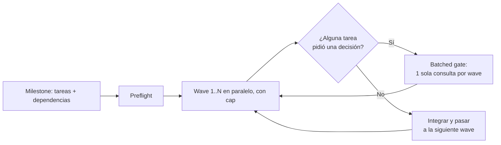

# Harness de orquestación IA

Un sistema reutilizable para dirigir trabajo de desarrollo asistido por IA
sobre **cualquier tipo de proyecto** — web, backend, apps móviles, análisis
de datos, CLI — agrupando tareas en oleadas ("waves") que corren en
paralelo cuando es posible, con un único punto de aprobación humana por
oleada.

Hecho para la Electiva de desarrollo asistido por IA, Septiembre 2026.

## Por dónde empezar

| Documento | Qué encontrás ahí |
|---|---|
| **[RESUMEN-HARNESS.md](RESUMEN-HARNESS.md)** | El entregable final: mapa de las 6 skills, el diagrama de flujo completo, y la política de no-respuesta explicada |
| **[PROCESO.md](PROCESO.md)** | La bitácora completa: cada decisión de diseño no trivial, con el porqué |
| **[CLAUDE.md](CLAUDE.md)** | Instrucciones para Claude Code: cómo se invoca cada skill y las convenciones del proyecto |

## La idea en una imagen



Diagrama completo, con el detalle de cada paso, en
[RESUMEN-HARNESS.md](RESUMEN-HARNESS.md).

## Estructura del repo

```
.claude/skills/          # las 6 skills del harness (orquestador + 5 de apoyo)
milestones/<slug>/       # manifest, estado y decisiones de cada milestone corrido
schema/ api/ ui/         # artefactos reales que dejó el milestone de ejemplo
PROCESO.md               # bitácora de decisiones de diseño
RESUMEN-HARNESS.md        # entregable final
```

## El ejemplo real

Todo el mecanismo se probó de punta a punta con un milestone ficticio real
— no simulado — de 5 tareas con dependencias entre sí, corridas por
sub-agentes de verdad. Manifest, decisiones y resultado en
[milestones/panel-tareas-demo/](milestones/panel-tareas-demo/).
