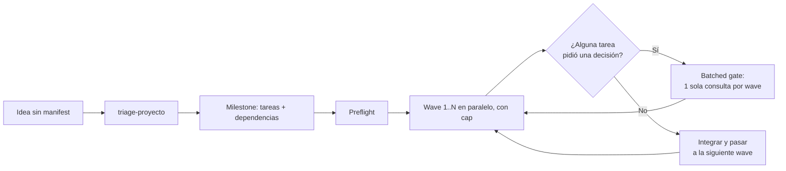

# Harness de orquestación IA

Un sistema reutilizable para dirigir trabajo de desarrollo asistido por IA
sobre **cualquier tipo de proyecto** — web, backend, apps móviles, análisis
de datos, CLI — agrupando tareas en oleadas ("waves") que corren en
paralelo cuando es posible, con un único punto de aprobación humana por
oleada.

Hecho para la Electiva de desarrollo asistido por IA, Septiembre 2026.

## Por dónde empezar

| Documento | Qué encuentras ahí |
|---|---|
| **[RESUMEN-HARNESS.md](RESUMEN-HARNESS.md)** | El entregable final: mapa de las 24 skills (13 propias y 11 vendorizadas), el diagrama de flujo completo, y la política de no-respuesta explicada |
| **[PROCESO.md](PROCESO.md)** | La bitácora completa: cada decisión de diseño no trivial, con el porqué |
| **[CLAUDE.md](CLAUDE.md)** | Instrucciones para Claude Code: cómo se invoca cada skill y las convenciones del proyecto |

## La idea en una imagen


```mermaid
flowchart LR
    I[Idea sin manifest] --> T[triage-proyecto]
    T --> A
    A[Milestone: tareas + dependencias] --> B[Preflight]
    B --> C[Wave 1..N en paralelo, con cap]
    C --> D{¿Alguna tarea<br/>pidió una decisión?}
    D -->|Sí| E[Batched gate:<br/>1 sola consulta por wave]
    E --> C
    D -->|No| F[Integrar y pasar<br/>a la siguiente wave]
    F --> C
```

Si todavía no hay manifest, la puerta de entrada es la skill
`triage-proyecto`: convierte una idea ambigua (o un plan en prosa) en un
`milestone.yaml` borrador que pasa el preflight, y a partir de ahí lo
ejecuta el orquestador. Diagrama completo, con el detalle de cada paso, en
[RESUMEN-HARNESS.md](RESUMEN-HARNESS.md).

## Inicio rápido

**Requisitos**: [Claude Code](https://code.claude.com), git y Python 3
(los scripts de validación solo usan la biblioteca estándar). Opcional:
[pandoc](https://pandoc.org/installing.html), para exportar documentos
académicos a Word.

1. Abre Claude Code en la raíz de este repo.
2. Si tienes una idea o un plan en prosa:
   ```
   /triage-proyecto <tu idea>
   ```
   Hace hasta 3 preguntas de opción múltiple y deja
   `milestones/<slug>/milestone.yaml`, ya validado.
3. Ejecútalo:
   ```
   /orquestador milestones/<slug>/milestone.yaml
   ```
   Las decisiones te llegan agrupadas, una vez por wave. Nada se publica
   ni se sube a internet sin tu aprobación.

Si la sesión se corta, vuelve a invocar `/orquestador` sobre el mismo
milestone: lee `estado.yaml` y reanuda donde quedó.

## Costo

Cada tarea del manifest lleva `modelo` y `verificacion` según un **perfil
de costo** por tipo: Sonnet por defecto, Opus solo cuando la tarea lo
justifica, y verificación de datos `ligera` salvo en trabajos académicos o
temas sensibles. Los sub-agentes agrupan comandos y leen por secciones.
Medido en la práctica: cerca de la mitad de llamadas y de contexto por
sub-agente frente a la versión anterior. Detalle y cifras en
[PROCESO.md §15](PROCESO.md).

## Estructura del repo

```
.claude/skills/          # 24 skills: 13 propias (orquestador, triage-proyecto y 11 de apoyo)
                         # + frontend-design (Anthropic) + 10 de Emil Kowalski
docs/vendor/             # origen y hash de las skills vendorizadas de Emil Kowalski
milestones/<slug>/       # manifest, estado y decisiones de cada milestone corrido
presentaciones/          # decks HTML generados con presentaciones-visuales
web/taller-inscripcion/  # web de inscripción que dejó la prueba e2e-skills-2
landing/enigma-go/       # landing de Enigma Go (lista para GitHub Pages, sin publicar)
schema/ api/ ui/         # artefactos reales que dejó el milestone de ejemplo
insumos-plan-mejora/     # insumos de las mejoras de skills
PLAN-MEJORA-SKILLS*.md   # planes de las dos ampliaciones de skills
GUION-PRESENTACION.md    # guion para exponer el harness
PROCESO.md               # bitácora de decisiones de diseño
RESUMEN-HARNESS.md       # entregable final
```

## Ejemplos reales

Todo corrido con sub-agentes de verdad, no simulado. Manifest, estado y
decisiones de cada uno en su carpeta de `milestones/`.

| Milestone | Qué demuestra |
|---|---|
| [panel-tareas-demo](milestones/panel-tareas-demo/) | El primer recorrido completo: 5 tareas con dependencias en 3 waves |
| [e2e-skills-2](milestones/e2e-skills-2/) | La prueba más completa: de una idea a backend con reglas de acceso, web para celular, despliegue que se detiene antes de publicar e informe APA 7 con referencias verificadas |
| [validacion-regional-aedesalert](milestones/validacion-regional-aedesalert/) y [canvas-aedesalert](milestones/canvas-aedesalert/) | Uso real en trabajos de clase: investigación, matriz verificada, guía y presentación |
| [mejora-skills](milestones/mejora-skills/) y [mejora-skills-2](milestones/mejora-skills-2/) | El harness ampliándose a sí mismo (de 6 a 24 skills) |
