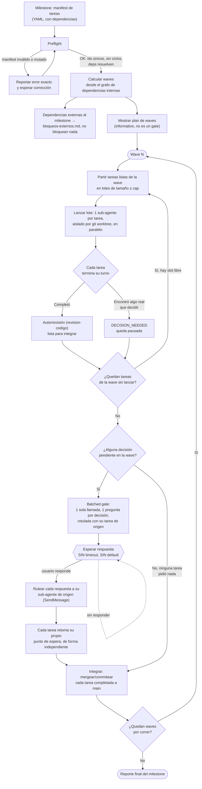
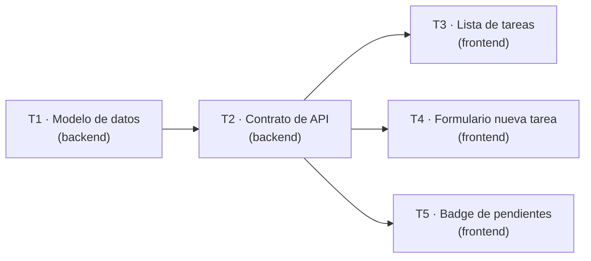

# RESUMEN-HARNESS.md — Entregable final

Mapa completo del harness: qué skills existen, cuándo se usa cada una, cómo
fluye un milestone de punta a punta, y por qué la política de no-respuesta
está diseñada como está. Para el *por qué* de cada decisión de diseño, ver
[PROCESO.md](PROCESO.md). Para un ejemplo real ejecutado con este mismo
harness, ver la sección 6 más abajo.

## 1. Las 6 skills, qué producen y cuándo se usan

| Skill | Qué produce | Cuándo se dispara |
|---|---|---|
| [`orquestador`](.claude/skills/orquestador/SKILL.md) | Ejecuta un milestone completo: preflight → waves → batched gate → integración | Punto de entrada del sistema. Se invoca con un manifest de tareas de cualquier tipo de proyecto |
| [`especificacion`](.claude/skills/especificacion/SKILL.md) | Documento de especificación técnica (objetivos, alcance, RF/RNF, criterios de aceptación) | Antes de implementar una tarea sin criterios de aceptación claros o con enunciado ambiguo |
| [`frontend-design`](.claude/skills/frontend-design/SKILL.md) | Dirección de diseño visual deliberada (paleta, tipografía, layout específicos del brief) | Al construir o rediseñar cualquier UI. Copiada sin modificar de `anthropics/claude-code` |
| [`revision-codigo`](.claude/skills/revision-codigo/SKILL.md) | Checklist de corrección, seguridad básica, legibilidad, convenciones y alcance | Autorrevisión de cada tarea, siempre antes de integrarla — nunca después |
| [`documentacion`](.claude/skills/documentacion/SKILL.md) | README, docs técnicas de decisiones, o comentarios inline | Al cerrar una tarea con funcionalidad visible, o al cerrar el milestone |
| [`testing`](.claude/skills/testing/SKILL.md) | Casos de prueba y estrategia, adaptados al tipo de proyecto | Al implementar cualquier lógica con comportamiento verificable |

`orquestador` es quien decide **cuándo**, dentro de una wave, se activa cada
skill de apoyo — el mapeo completo por tipo de proyecto está en su propio
SKILL.md, §8. Las demás skills también funcionan sueltas, fuera de una wave.

## 2. Flujo completo: milestone → waves → batched gate

## 3. La política de no-respuesta, y por qué existe

**Mientras el batched gate de una wave tenga una sola decisión sin
responder: ningún sub-agente pausado se reanuda, la wave no cierra, y
ninguna wave posterior arranca. No hay timeout. El sistema no asume "sí",
no elige la opción por defecto, y no interpreta silencio como aprobación.**

Por qué es una regla dura y no una preferencia:

- **El batched gate solo tiene valor si es real.** Si el orquestador pudiera
  seguir adelante después de un rato sin respuesta, el gate dejaría de ser
  un punto de control y pasaría a ser una notificación decorativa — la
  presión implícita de "si no contesto, igual sigue" empuja a aprobar rápido
  y sin pensar, exactamente lo que el gate está diseñado para evitar.
- **Las decisiones que llegan al gate son, por construcción, las que
  importan.** `revision-codigo` y las propias tareas ya resuelven solas todo
  lo que tiene una respuesta obvia (ver el ejemplo real en la sección 6: dos
  de las cinco tareas del milestone de ejemplo no generaron ninguna
  decisión). Lo que llega al gate es, precisamente, lo que un sub-agente ya
  determinó que **no** debía decidir solo. Adivinar ahí tiene el costo más
  alto posible.
- **Un default silencioso es una decisión de producto disfrazada de
  ingeniería.** Elegir "la primera opción" o "la más segura" como fallback
  automático es, en los hechos, tomar esa decisión — pero sin que quede
  registrada como tal ni tenga a nadie que responda por ella.

## 4. Bloqueos externos al milestone

Una dependencia que no resuelve a ninguna tarea del propio manifest debe
quedar declarada explícitamente como externa (`fuera_de_alcance_si_depende_de`
en el manifest — ver `orquestador/SKILL.md` §4). Una tarea con una
dependencia externa sin resolver queda `BLOQUEADA_EXTERNA` desde el
preflight: no entra a ninguna wave, se registra en `bloqueos-externos.md`
del milestone, y **no** detiene el resto — el resto de las waves corre con
normalidad. Ejemplo ilustrativo: si una tarea de este mismo milestone de
demo necesitara que el equipo de infraestructura habilite un dominio
público antes de desplegar, esa dependencia se anota aparte y las demás
tareas (esquema, contrato, UI) siguen su curso sin esperarla.

## 5. Aislamiento por worktree y cap de concurrencia

Cada tarea corre en su propio git worktree (`Agent` con
`isolation: "worktree"`), así varias tareas avanzan en paralelo sin pisarse
los archivos. El cap de concurrencia (`cap_concurrencia` en el manifest,
default 3) limita cuántos sub-agentes hay en vuelo a la vez dentro de una
wave: si hay más tareas listas que el cap, se lanzan en lotes — un
sub-agente "libera su slot" en cuanto termina su turno, sea porque completó
o porque quedó pausado esperando una decisión (así una tarea pausada no
frena el avance del resto de la wave). El detalle completo, con el motivo de
cada decisión de diseño, está en `orquestador/SKILL.md` §5 y en
[PROCESO.md](PROCESO.md) §4.

## 6. El ejemplo real: milestone "Panel de administración de tareas"

Para demostrar el mecanismo, se corrió un milestone ficticio completo con
este mismo harness — no una simulación narrada, sino sub-agentes reales
escribiendo archivos reales. Manifest completo en
[milestones/panel-tareas-demo/milestone.yaml](milestones/panel-tareas-demo/milestone.yaml).

**Grafo de dependencias y waves:**

| Wave | Tareas | Tamaño vs. cap (2) | Resultado |
|---|---|---|---|
| 1 | T1 | 1 tarea, 1 lote | Completó directo — sin decisiones |
| 2 | T2 | 1 tarea, 1 lote | `especificacion` corrida primero (criterios de aceptación vacíos en el manifest); con esa especificación, completó directo |
| 3 | T3, T4, T5 | 3 tareas listas, cap 2 → 2 lotes (T3+T4, después T5) | T5 completó directo; **T3 y T4 escalaron una decisión real cada una**, presentadas juntas en un solo batched gate |

**El batched gate real de la wave 3** — bitácora completa en
[milestones/panel-tareas-demo/decisiones.md](milestones/panel-tareas-demo/decisiones.md):

1. *T3*: ¿filtro/orden por estado en la lista, o mantenerla simple? →
   se eligió agregar filtro/orden.
2. *T4*: ¿validar el título también en el cliente, o confiar solo en el
   servidor? → se eligió confiar solo en el servidor.

Ambas preguntas llegaron en una única interacción, cada una rotulada con su
tarea de origen; cada respuesta se ruteó de vuelta a su propio sub-agente
(`SendMessage`), que retomó su propio punto de espera sin ver la decisión
de la otra tarea.

**Entregable de muestra de `especificacion`**:
[milestones/panel-tareas-demo/especificaciones/T2-contrato-api.md](milestones/panel-tareas-demo/especificaciones/T2-contrato-api.md) —
generado a partir del esquema real que produjo T1, no del manifest
original (que traía T2 sin criterios de aceptación).

**Artefactos de producto que dejó la corrida**: [schema/tareas.md](schema/tareas.md),
[api/contrato-tareas.md](api/contrato-tareas.md),
[ui/lista-tareas.html](ui/lista-tareas.html),
[ui/nueva-tarea.html](ui/nueva-tarea.html),
[ui/badge-pendientes.html](ui/badge-pendientes.html) — cada uno con su
propio commit de git, trazable a la tarea que lo generó.

**Nota honesta sobre esta corrida en particular**: el aislamiento por
worktree y el registro de skills nuevas dentro de la misma sesión chocaron
con una limitación puntual del entorno (el proyecto no era un repositorio
git cuando la sesión arrancó). El diagnóstico completo, lo que se intentó, y
por qué no invalida el diseño del harness, está documentado en
[PROCESO.md](PROCESO.md) §7.
